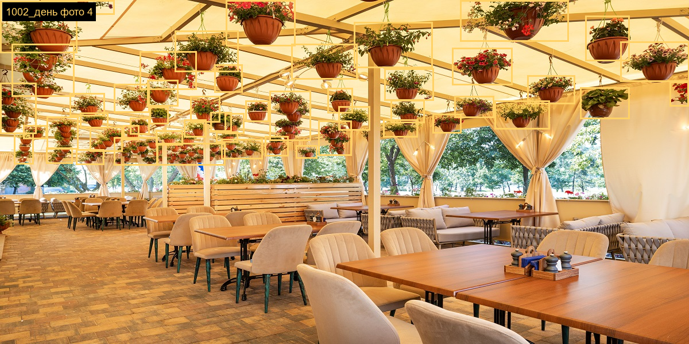
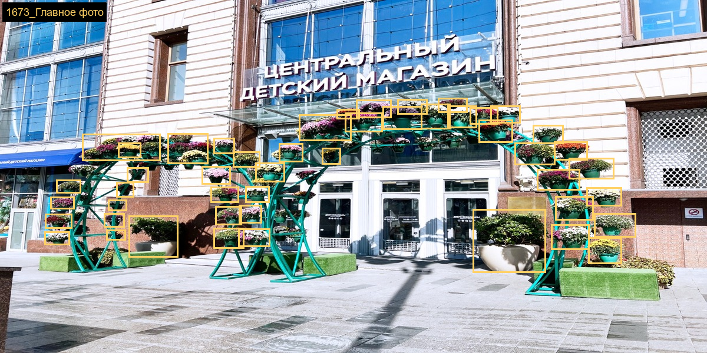
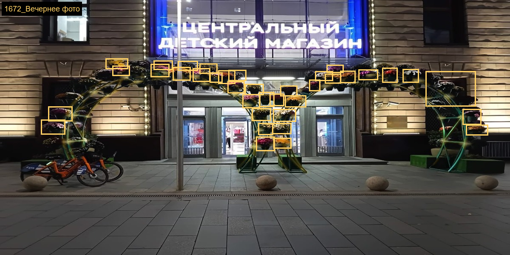
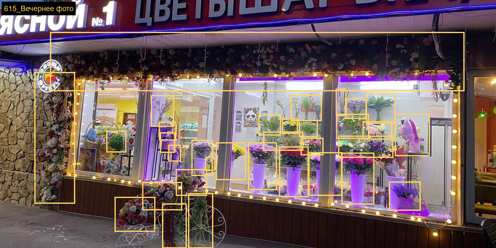
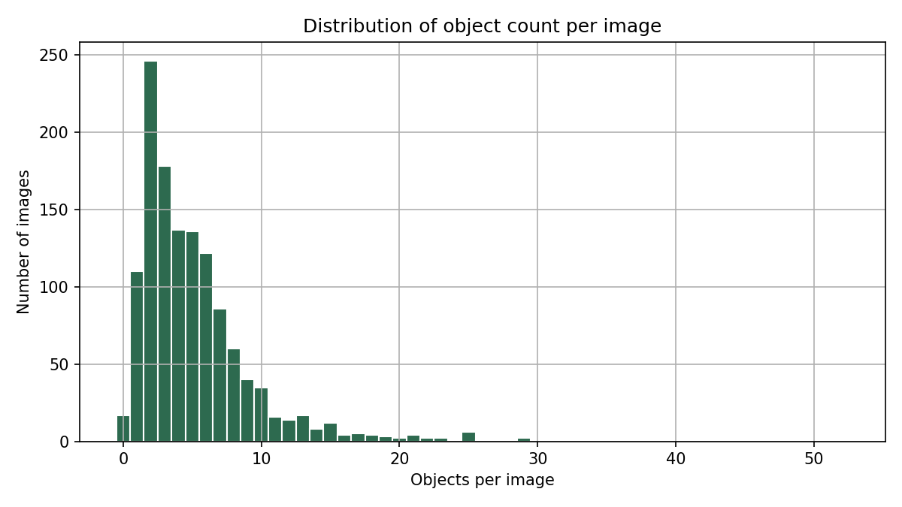
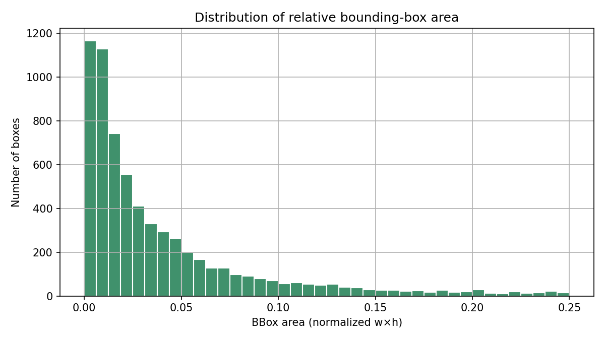

# Детекция декоративных цветов и растений на фасадах

Проект по дисциплине **«Сбор, генерация и разметка данных»**: детекция декоративных цветов и растений на фотографиях фасадов заведений (Москва). Разметка в формате **YOLO** (один класс `flower`), изображения - дневные/вечерние/ночные снимки.

## Что лежит в этом репозитории

Здесь выложена **учебная подвыборка** (мини-датасет), на которой обучалась модель для **полуавтоматической** разметки остальных кадров. Полный продовый датасет (≈4,5k фото, 20k+ объектов) в репозиторий не входит из соображений объема.


| Показатель | Значение (этот репозиторий) |
|------------|-----------------------------|
| Изображений | 1 276 |
| Размеченных bbox | 6 720 |
| Классов | 1 (`flower`) |
| Примерный объем `data/` | ~320 МБ |

## Метрики основной модели (валидация, ~1,5k фото)

Показатели относятся к **полной** выборке и итоговому обучению, не к мини-датасету в этом репозитории.

| Метрика | Значение |
|---------|----------|
| Precision | 0,903 |
| Recall | 0,845 |
| mAP@0.5 | 0,923 |

## Структура репозитория

```text
project_flowers/
├── README.md                 
├── obj.data                  # конфиг
├── data/
│   ├── train.txt             # список путей к изображениям для обучения
│   ├── obj.names             # имена классов (flower)
│   └── obj_train_data/       # пары image +  .txt 
└── docs/
    └── assets/               # PNG: графики и примеры разметки (можно пересобрать скриптом)
```

## Формат разметки

Каждая строка в `*.txt`:

```text
<class_id> <x_center> <y_center> <width> <height>
```

Все координаты **нормированы** на ширину и высоту изображения (0…1). Для этого датасета `class_id` всегда `0` (класс `flower`).

## Примеры разметки (визуализация bbox)

Ниже — несколько кадров с нарисованными прямоугольниками по разметке (цвет рамки условный, для наглядности).









## Графики по мини-датасету

Распределение числа объектов на изображении и относительных площадей bbox (нормализованное произведение ширины на высоту в долях кадра):




